# Gemini Translator — Master Plan v3

> **Location**: Project Root (`ROADMAP.md`)  
> **Status**: Active Living Document  
> **Target Milestones**: v8.11.0 – v8.30.0  
> **Total**: 70 features · 30 OSS libraries · 9 shipped

---

## 📋 Table of Contents

1. [OSS Integration Map (30 Libraries)](#oss-integration-map)
2. [§1 Infrastructure Upgrades (v8.11)](#1-infrastructure-upgrades-v811)
3. [§2 Library & Novel Tracking (v8.11–8.12)](#2-library--novel-tracking)
4. [§3 Immersive Reader & Audio (v8.12–8.13)](#3-immersive-reader--audio)
5. [§4 Smart Crawling & Source Extensions (v8.14)](#4-smart-crawling--source-extensions)
6. [§5 AI Translation & Story Intelligence (v8.15–8.19)](#5-ai-translation--story-intelligence)
7. [§6 Cloud Sync & Multi-Device (v8.14–8.16)](#6-cloud-sync--multi-device)
8. [§7 Crawl Intelligence & Novel Management (v8.20–8.21)](#7-crawl-intelligence--novel-management)
9. [§8 Reader Intelligence & Social (v8.22–8.25)](#8-reader-intelligence--social)
10. [§9 AI Generation, Export & Platform (v8.25–8.28)](#9-ai-generation-export--platform)
11. [§10 Accessibility & Platform (v8.29–8.30)](#10-accessibility--platform)
12. [Prioritization Matrix (68 features)](#prioritization-matrix)
13. [Dependency Graph](#dependency-graph)

---

## OSS Integration Map

### Core (18 libraries)

| Library | npm Package | Size | License | Used By |
|---|---|---|---|---|
| **foliate-js** | git submodule | ~50 KB | MIT | Reader rebuild, annotations, search, pagination |
| **Dexie.js** | `dexie` | ~32 KB | Apache-2.0 | ALL IndexedDB, reactive queries, schema migrations |
| **fflate** | `fflate` | ~8-30 KB | MIT | EPUB gen/parse (replaces JSZip) |
| **he** | `he` | ~5 KB | MIT | HTML entity decoding (fixes `&#8216;` bug) |
| **DOMPurify** | `dompurify` | ~15 KB | Apache-2.0 | Sanitize crawled HTML, XSS prevention |
| **@mozilla/readability** | `@mozilla/readability` | ~20 KB | Apache-2.0 | Universal fallback parser for any website |
| **Fuse.js** | `fuse.js` | ~5 KB | Apache-2.0 | Library search, cross-novel search |
| **diff-match-patch-es** | `diff-match-patch-es` | ~8 KB | Apache-2.0 | Translation diffs, battle mode |
| **Chart.js** | `chart.js` | ~65 KB | MIT | Stats dashboard, heatmaps |
| **kuromoji** | `kuromoji` | ~20 MB dict | Apache-2.0 | Japanese tokenization |
| **Kuroshiro** | `kuroshiro` | ~10 KB | MIT | Furigana ruby generation |
| **hanzi** | `hanzi` | ~5 MB dict | MIT | Chinese segmentation, CC-CEDICT |
| **cc-cedict** | `cc-cedict` | ~5 MB dict | MIT | Chinese-English dictionary |
| **jmdict-simplified-node** | `jmdict-simplified-node` | ~40 MB dict | CC-BY-SA | Japanese-English dictionary |
| **ts-fsrs** | `ts-fsrs` | ~15 KB | MIT | Spaced repetition flashcards |
| **webdav** | `webdav` | ~30 KB | MIT | WebDAV cloud sync |
| **edge-tts-node** | `edge-tts-node` | ~10 KB | MIT | Free neural TTS (300+ voices) |
| **Web Speech API** | native | 0 KB | — | Basic TTS, sentence boundary sync |

### Extended (12 libraries)

| Library | npm Package | Size | License | Used By |
|---|---|---|---|---|
| **Comlink** | `comlink` | 1.1 KB | Apache-2.0 | Web Worker communication (non-blocking UI) |
| **Workbox** | `workbox-*` | ~20 KB | MIT | PWA offline caching strategies |
| **dexie-export-import** | `dexie-export-import` | ~5 KB | Apache-2.0 | One-line DB backup/restore |
| **lz-string** | `lz-string` | ~5 KB | MIT | Text compression (70% smaller storage) |
| **node-vibrant** | `node-vibrant` | ~15 KB | MIT | Extract dominant colors from cover art |
| **SortableJS** | `sortablejs` | ~10 KB | MIT | Drag-drop reorder (queue, library) |
| **dayjs** | `dayjs` | 2 KB | MIT | Date formatting ("3 days ago") |
| **Tesseract.js** | `tesseract.js` | ~200 KB | Apache-2.0 | Offline OCR (100+ languages, WASM) |
| **Mermaid.js** | `mermaid` | ~300 KB | MIT | Character relationship diagrams |
| **markdown-it** | `markdown-it` | ~30 KB | MIT | Wiki/notes rendering |
| **compromise** | `compromise` | ~200 KB | MIT | English NLP (name extraction) |
| **FlexSearch** | `flexsearch` | ~6 KB | Apache-2.0 | Full-text search (100K+ docs) |

**Total bundle (excluding dictionaries): ~330 KB gzipped**

---

## 1. Infrastructure Upgrades (v8.11)

### 🔧 1.0 IndexedDB → Dexie.js Migration
**v8.11.0 · Medium · ✅ Shipped** · OSS: `dexie`

Replace raw IndexedDB with Dexie.js for both databases.
1. Download offline vendored `vendor/dexie.min.js`
2. Define schema in `db_engine.js`: `GeminiTranslatorNovelDB` (v3 & v4) and `GeminiTranslatorDB` (v1) with secondary indexes (`id, title, status, sourceUrl, addedAt, deletedAt, timestamp`)
3. Seamless fallback and custom change events (`gemini:novel-db-change`)

**Deps**: None · **Breaks**: Nothing — wraps existing DBs seamlessly

### 📦 1.0b JSZip → fflate
**v8.11.0 · Low · ✅ Shipped** · OSS: `fflate`

2-10x faster EPUB gen, non-blocking, smaller bundle.
1. Vendored offline `vendor/fflate.min.js`
2. Integrated `zipSync` into `epub_engine.js` with STORE level 0 for mimetype and level 6 for content
3. Integrated `unzipSync` into `web_importer.js` for instant EPUB unpacking

### 🧹 1.0c Add he.js + DOMPurify
**v8.11.0 · Low · ✅ Shipped** · OSS: `he`, `dompurify`

Fix HTML entity bug, add proper sanitization.
1. `he.decode()` — fixes `&#8216;` → `'` across chapter titles and text
2. `DOMPurify.sanitize(html)` for all crawled and imported content

---

## 2. Library & Novel Tracking

### 🔄 2.1 Delta Crawl ("Check for New Chapters")
**v8.11.0 · Medium · ✅ Shipped**

Fetch only new chapters, not entire novel. Selective deduplication in `crawlWithPlugin`, returning combined chapter list without re-downloading existing chapters.

### 🔖 2.2 Reading Progress & Bookmark Cloud Sync
**v8.14.0 · Medium · 📋 Planned** · OSS: `webdav`

Track `{ novelId, chapterIndex, scrollPct, lastReadTs }`. Sync to Google Drive/WebDAV. "Resume from other device?"

### 🚻 2.3 Anti-Pronoun Drift / Gender Lock
**v8.11.0 · Medium · ✅ Shipped**

Lock character genders. Auto-detect genders from glossary annotations. Injected `=== GENDER LOCK PROTOCOL (ANTI-PRONOUN DRIFT) ===` into `buildPrompt()`. 1-tap `⚥ He↔She` pronoun swap in Reader HUD.

---

## 3. Immersive Reader & Audio

### 📖 3.1 Reader Rebuild → foliate-js
**v8.12.0 · High · 📋 Planned** · OSS: `foliate-js`

Replace `reader_engine.js` entirely. Pagination, annotations, search, themes, font customization. Keep our translation UI on top.

### 🌐 3.2 Bilingual / Parallel Reading
**v8.12.0 · Low · 📋 Planned**

Toggle: `[ English ] | [ Parallel ] | [ Source ]`. Tap-to-inspect paragraph alignment. **Deps**: §3.1

### 💡 3.3 Glossary Tooltips in Reader
**v8.12.0 · Medium · 📋 Planned**

Tap character names → floating glossary card with canonical name + source term. Uses foliate overlayer. **Deps**: §3.1

### 🎧 3.4 Neural TTS / Audiobook Mode
**v8.13.0 · Medium · 📋 Planned** · OSS: Web Speech API + `edge-tts-node`

Tier 1: `speechSynthesis` (zero deps, word highlighting via `onboundary`). Tier 2: Edge TTS (300+ neural voices, free). Android lock screen controls via `navigator.mediaSession`. **Deps**: §3.1

### 🔄 3.5 1-Tap Paragraph Retranslate
**v8.13.0 · Low · 📋 Planned**

Long-press paragraph → "Retry Translation" → send to Gemini with glossary + context → replace in-place. **Deps**: §3.1

---

## 4. Smart Crawling & Source Extensions

### 🛠️ 4.1 LNReader Plugin Architecture
**v8.14.0 · High · 📋 Planned** · Ref: LNReader plugin system

Standard `SourcePlugin` interface: `search()`, `getNovelDetails()`, `getChapterContent()`. Refactor existing crawlers as built-in plugins. User-installable community plugins via URL. **Deps**: §1.0

### 🧹 4.1b Universal Fallback Parser
**v8.14.0 · Low · 📋 Planned** · OSS: `@mozilla/readability`

When no plugin matches URL, try Readability (same as Firefox Reader View). Works on most sites with zero config. **Deps**: §4.1

### 🎨 4.2 Custom CSS Selector Crawler Builder
**v8.14.0 · High · 📋 Planned**

Visual tool: enter base URL, title selector, content selector, next-chapter selector. Live preview. Export/import as JSON. **Deps**: §4.1

### 🌓 4.3 Dark Mode Illustration Filter
**v8.15.0 · Low · 📋 Planned**

CSS: `.reader-dark img { filter: brightness(0.85) contrast(1.1); }`. Toggle on/off. **Deps**: §3.1

---

## 5. AI Translation & Story Intelligence

### 📖 5.1 Story Recap ("Previously On...")
**v8.15.0 · Medium · 📋 Planned**

Appears when >24h since last read. Gemini summarizes last 3-5 chapters: events, tensions, character status. Cached in Dexie. **Deps**: §1.0

### 🕸️ 5.2 Character Relationship Map
**v8.15.0 · Medium · 📋 Planned** · OSS: `mermaid`

Gemini extracts relationships → Mermaid graph. Tap node → wiki card. Updates incrementally. **Deps**: §1.0

### 🎭 5.3 Genre Tone Presets
**v8.16.0 · Low · 📋 Planned**

Presets: 📚 Published LN, ⚔️ Xianxia, 🎮 LitRPG, 🗡️ Korean Hunter, 🎓 Study Mode. Injected into `buildPrompt()`. Custom preset editor.

### 🎓 5.4 Language Learning Mode
**v8.17.0 · High · 📋 Planned** · OSS: `kuromoji`, `kuroshiro`, `hanzi`, `cc-cedict`, `jmdict-simplified-node`, `ts-fsrs`

Tap-to-dictionary (JP/CN/KR). Furigana rendering. Vocabulary collector. SRS flashcards from reading context. Progressive immersion (4 levels). **Deps**: §3.1, §1.0

### 🔄 5.5 Name Consistency Enforcer
**v8.17.0 · Medium · 📋 Planned** · OSS: `fuse.js`, `compromise`

Scan chapters for proper nouns. Fuzzy-cluster similar names. Dashboard + batch normalize. Auto-add to glossary. **Deps**: §1.0

### 📖 5.6 Auto-Generated Character Wiki
**v8.18.0 · High · 📋 Planned** · OSS: `markdown-it`

Gemini extracts characters/locations/terms per chapter. Incremental wiki in Dexie. Spoiler filter (only up to current chapter). Popup cards in reader. **Deps**: §1.0, §3.1

### ⚔️ 5.7 Translation Battle Mode
**v8.18.0 · Medium · 📋 Planned** · OSS: `diff-match-patch-es`

Run 2-3 engines in parallel. Side-by-side diff comparison. AI judges fluency/accuracy/style. Auto-stitch best paragraphs.

### 🧬 5.8 Smart Glossary Auto-Builder
**v8.19.0 · Medium · 📋 Planned**

AI pre-reads Ch 1-2, extracts names/honorifics/terms as JSON. User reviews in approval modal. Glossary locked in from chapter 1.

### 🔍 5.9 Translation Proofreader QA
**v8.19.0 · Medium · 📋 Planned**

Auto-checks: paragraph count match, CJK leak detection, duplicate paragraphs, grammar. Report card per chapter. Batch retranslate flagged. **Deps**: §1.0

### 📝 5.10 Cultural Context Footnotes
**v8.19.0 · Medium · 📋 Planned**

AI inserts [¹] markers + footnotes for cultural references. Toggle on/off. Build per-language encyclopedia. **Deps**: §3.1

### ✏️ 5.11 Auto-Chapter Naming
**v8.19.0 · Low · 📋 Planned**

AI generates descriptive subtitles: `Chapter 147 — The Witch's Tea Party`. Accept/edit/dismiss per chapter. **Deps**: §1.0

---

## 6. Cloud Sync & Multi-Device

### ⏰ 6.1 Background Auto-Sync
**v8.16.0 · Medium · 📋 Planned** · OSS: `@capacitor/background-runner`, `webdav`, `dexie-export-import`

Scheduling: On Every Translation / Daily / Weekly. Incremental backup via `dexie-export-import`. Targets: Google Drive, WebDAV. **Deps**: §1.0

### 📡 6.2 OPDS Server & Send-to-Kindle
**v8.16.0 · Medium · 📋 Planned**

OPDS feed for Moon+ Reader/KOReader. Send-to-Kindle via `@kindle.com` email.

### 🎨 6.3 AI Cover Art
**v8.16.0 · Medium · 📋 Planned** · OSS: `node-vibrant`

Gemini Imagen generates cover art. `node-vibrant` extracts color palette for per-novel UI theming (Spotify-style).

---

## 7. Crawl Intelligence & Novel Management

### 🏥 7.1 Novel Health Report
**v8.20.0 · Medium · 📋 Planned**

Post-crawl: missing chapters, duplicates, empty chapters, encoding issues, image audit. "484 crawled · ✅ 480 healthy · ⚠️ 3 short · ❌ 1 missing"

### 💰 7.2 Cost & Time Estimator
**v8.20.0 · Low · 📋 Planned**

Count words, estimate tokens, show cost per engine. Suggest optimal strategy.

### 📐 7.3 Smart Arc Splitter
**v8.20.0 · Medium · 📋 Planned**

Gemini detects arc boundaries. Library shows volumes. Per-volume EPUB export. **Deps**: §1.0

### 🏷️ 7.4 Metadata Enrichment
**v8.20.0 · Medium · 📋 Planned**

Auto-fetch from NovelUpdates, MAL, AniList: genre tags, ratings, synopsis, anime adaptation links. **Deps**: §1.0

### 🛡️ 7.5 Anti-MTL Quality Gate
**v8.21.0 · Medium · 📋 Planned**

Auto-flag low quality (coherence, completeness, CJK leaks). Detect quota degradation. **Deps**: §5.9

### 🎭 7.6 Reading Mood Matcher
**v8.21.0 · Medium · 📋 Planned**

"I want something light" → AI scans library + recommends. Time-aware. Re-engagement nudges. **Deps**: §1.0

---

## 8. Reader Intelligence & Social

### 💬 8.1 AI Chat Companion (Spoiler-Safe)
**v8.22.0 · Medium · 📋 Planned**

"Ask" button in reader. Gemini loaded with chapters 1→current only. Chat history per-novel. **Deps**: §1.0, §3.1

### 🗄️ 8.2 Translation Memory Bank
**v8.22.0 · High · 📋 Planned** · Ref: Open TLC, OSS: `comlink` (for fuzzy match in worker)

Cache every source→translation pair. Exact match = zero cost. Fuzzy match (>90%) = partial retranslate. Dashboard: "TM saved 12,000 tokens." **Deps**: §1.0

### 🌙 8.3 Translation Queue & Overnight Scheduler
**v8.22.0 · Medium · 📋 Planned** · OSS: `sortablejs`, `@capacitor/background-runner`

Queue UI with drag-to-reorder. Sequential execution. Smart quota management. Push notification on completion. **Deps**: §1.0

### 💬 8.4 Smart Dialogue Formatter
**v8.23.0 · Medium · 📋 Planned**

Prompt: format dialogue with proper quotes, paragraph breaks per speaker. Post-processing merge. Toggle per novel.

### 🖼️ 8.5 Image OCR Translation
**v8.23.0 · Medium · 📋 Planned** · OSS: `tesseract.js` (offline) or Gemini Vision (online)

Detect images with text. Extract via Tesseract.js (free, offline) or Gemini Vision. Translate. Display as caption/overlay.

### 📸 8.6 Translation Snapshots & Versions
**v8.23.0 · Medium · 📋 Planned** · OSS: `diff-match-patch-es`

Save translation versions. Diff view (paragraph-by-paragraph). Rollback. Cherry-pick best paragraphs. **Deps**: §1.0

### 📅 8.7 Novel Completion Predictor
**v8.24.0 · Low · 📋 Planned**

Track author release frequency. "Updates every 2.3 days · Est. completion: March 2027." Hiatus warning. **Deps**: §2.1

### 📝 8.8 Auto-Synopsis Generator
**v8.24.0 · Low · 📋 Planned**

Gemini reads first 3-5 chapters → synopsis, genre tags, tagline. Auto-fill library card. **Deps**: §1.0

### 🔎 8.9 Cross-Novel Universal Search
**v8.24.0 · Medium · 📋 Planned** · OSS: `flexsearch`, `fuse.js`

FlexSearch indexes all translated chapters. Fuse.js for fuzzy title/author matching. Results grouped by novel + context snippet. **Deps**: §1.0

### 📐 8.10 Smart Paragraph Merging
**v8.24.0 · Medium · 📋 Planned**

Fix one-sentence paragraphs (CN novels). AI merges into flowing prose. Normalize scene breaks. Toggle per novel.

### 📊 8.11 Stats Dashboard
**v8.25.0 · Medium · 📋 Planned** · OSS: `chart.js`, `dayjs`

GitHub-style streak heatmap. Words/day chart. Engine usage pie. Money saved calculation. Milestones. **Deps**: §1.0

---

## 9. AI Generation, Export & Platform

### 🎨 9.1 AI Scene Illustrator
**v8.25.0 · High · 📋 Planned** · OSS: Gemini Imagen

"Illustrate This" → anime-style scene art. Character consistency from wiki. Gallery view. **Deps**: §5.6

### 📖 9.2 Text Simplification (ESL)
**v8.25.0 · Low · 📋 Planned**

Easy (A2-B1) / Standard / Literary. Prompt modifier per novel.

### 🌐 9.3 Static Website Export
**v8.26.0 · Medium · 📋 Planned**

One-click → hostable site with TOC, navigation, search, dark mode. Deploy to GitHub Pages.

### 📦 9.4 Import from Other Apps
**v8.26.0 · High · 📋 Planned**

Parse Mihon protobuf, LNReader JSON, Calibre SQLite, Kindle clippings, NovelUpdates list. **Deps**: §1.0

### 🎯 9.5 Adaptive Translation Quality
**v8.26.0 · Medium · 📋 Planned**

AI classifies chapter: action→Pro, dialogue→Flash, filler→Lite. User sets quality floor. Cost tracking.

### ✍️ 9.6 Style Analyzer & Matcher
**v8.27.0 · Medium · 📋 Planned**

Gemini analyzes author's voice → Style Profile. Inject into every prompt for consistency. **Deps**: §1.0

### 🔖 9.7 Smart Bookmarks + AI Tags
**v8.27.0 · Medium · 📋 Planned**

Bookmark → auto-tag `#plot-twist` `#fight-scene`. AI summary per bookmark. Gallery of best moments. **Deps**: §3.1, §1.0

### 👥 9.8 Translation Sharing
**v8.27.0 · High · 📋 Planned**

Shareable link/QR. Collaborative editing. Translation fork → merge. Credit system.

### 🎧 9.9 Audiobook Export (MP3/M4B)
**v8.28.0 · High · 📋 Planned** · OSS: `edge-tts-node`

Synthesize all chapters. Export MP3 per chapter or M4B with chapter markers. ID3 metadata. **Deps**: §3.4

### 🧭 9.10 Semantic Scene Search
**v8.28.0 · Medium · 📋 Planned** · OSS: Gemini Embeddings

"Find the scene where Rem confesses" → cosine similarity on paragraph embeddings. Cross-novel. **Deps**: §1.0

### 🔔 9.11 Smart Notifications
**v8.28.0 · Medium · 📋 Planned** · OSS: `@capacitor/local-notifications`

Context-aware: "Continue Re:Zero Ch 52?", "3 chapters from finishing Arc 3!", "Streak at risk!" **Deps**: §1.0

---

## 10. Accessibility & Platform (v8.29–8.30)

### 🧠 10.1 On-Device Offline Translation
**v8.29.0 · Medium · 📋 Planned** · OSS: Native Chrome/Edge Translation API (0 KB)

Chrome 138+ and Edge 148+ ship built-in local translation: 37-145 languages, free, private, offline, zero API cost. Add as Tier 0 engine. `self.ai.translator.create({ sourceLanguage: 'ja', targetLanguage: 'en' })`. Use as free fallback when Gemini quota exhausted.

### 👁️ 10.2 Accessibility / Dyslexia Support
**v8.29.0 · Medium · 📋 Planned** · OSS: OpenDyslexic font (free)

OpenDyslexic, Lexend, Atkinson Hyperlegible fonts. Bionic Reading (bold first letters). Line Focus (dim other lines). Adjustable letter/word spacing. Color overlays (sepia, green tint). **Deps**: §3.1

### ⏱️ 10.3 Focus / Pomodoro Reading Timer
**v8.29.0 · Low · 📋 Planned**

25min read → break → resume cycle. Session tracking: "You read 1h 23m today." Streak protection.

### 📱 10.4 Novel Tracker Integration
**v8.29.0 · Medium · 📋 Planned** · OSS: AniList GraphQL API (free)

Sync reading progress to AniList / MAL / NovelUpdates. Auto-update status + chapter count. Pull recommendations from tracker.

### 📋 10.5 Reading List / "Plan to Read"
**v8.29.0 · Low · 📋 Planned**

Separate wishlist from library. Add from URL without crawling. Import from NovelUpdates reading list. **Deps**: §1.0

### 🔒 10.6 Encrypted Library / App Lock
**v8.29.0 · Medium · 📋 Planned** · OSS: Web Crypto API (native)

PIN / biometric lock on app launch. Encrypt stored novels in IndexedDB. Privacy for shared devices.

### 🎮 10.7 Reading Gamification / Achievements
**v8.29.0 · Medium · 📋 Planned**

📚 Bookworm: 100 chapters in one day. 🌍 Polyglot: translated from 3 languages. 🔥 On Fire: 30-day streak. 💎 Quality King: 0 QA flags in 50 chapters. XP system, levels, badges. **Deps**: §8.11

### 🔗 10.8 Deep Linking / URL Scheme
**v8.29.0 · Low · 📋 Planned** · OSS: Capacitor Deep Links

`gemini-translator://novel/rezero/chapter/52`. Share chapter locations via link. Open from notifications directly to correct chapter.

### 🌐 10.9 Browser Extension Mode
**v8.30.0 · High · 📋 Planned**

Chrome/Firefox extension: translate ANY webpage in-place. Select text → translate inline. Uses your Gemini API key.

### 🤖 10.10 AI Voice Cloning for TTS
**v8.30.0 · High · 📋 Planned**

Clone narrator voice. Different voice per character in dialogue. Consistent voice across all chapters. **Deps**: §3.4

### 📄 10.11 PDF Export
**v8.30.0 · Medium · 📋 Planned** · OSS: `pdf-lib` (~100 KB)

Export translated novels as formatted PDF. Page numbers, margins, headers. Print-ready for physical copies.

### ⏪ 10.12 Reading History Timeline
**v8.30.0 · Medium · 📋 Planned** · OSS: `dayjs`

Visual timeline of everything read + when. "On this day last year you started Re:Zero." Nostalgia + re-read suggestions. **Deps**: §1.0

### 🌡️ 10.13 Translation Confidence Heatmap
**v8.29.0 · Low · 📋 Planned**

AI rates its own confidence per sentence during translation. Reader color-tint: 🟢 high, 🟡 moderate, 🔴 low confidence. Tap red/yellow → see original source text. "Suggest better translation" → manual fix saved to glossary. Trivial prompt change: add "rate confidence 1-10 per sentence" to `buildPrompt()`.

### 📊 10.14 Novel Intelligence Dashboard
**v8.30.0 · Medium · 📋 Planned** · OSS: `chart.js`

AI analyzes full novel and generates: pacing graph (action density per chapter), character screen time (stacked area chart), mood timeline (comedy→dark→action shifts), arc boundaries (auto-detected), translation quality trend. Per-novel analytics beyond the global stats dashboard. **Deps**: §1.0

---

## Prioritization Matrix

| # | Feature | Version | Complexity | OSS Library | Status |
|---|:---|:---|:---|:---|:---|
| — | Throttled Crawl Persistence | v8.10.1 | Medium | — | ✅ Done |
| — | Crash-Proof Resume | v8.10.1 | Medium | — | ✅ Done |
| — | 1-Tap Google Drive Backup | v8.10.1 | Medium | — | ✅ Done |
| — | COTE Consistency Rule | v8.10.1 | Low | — | ✅ Done |
| 1 | IndexedDB → Dexie.js | v8.11.0 | Medium | `dexie` | 📋 Planned |
| 2 | JSZip → fflate | v8.11.0 | Low | `fflate` | 📋 Planned |
| 3 | he.js + DOMPurify | v8.11.0 | Low | `he` `dompurify` | 📋 Planned |
| 4 | Gender Lock | v8.11.0 | Medium | — | 📋 Ready |
| 5 | Delta Crawl | v8.11.0 | Medium | — | 📋 Planned |
| 6 | Reader → foliate-js | v8.12.0 | High | `foliate-js` | 📋 Planned |
| 7 | Bilingual Reading | v8.12.0 | Low | — | 📋 Planned |
| 8 | Glossary Tooltips | v8.12.0 | Medium | — | 📋 Planned |
| 9 | TTS / Audiobook | v8.13.0 | Medium | Web Speech + `edge-tts` | 📋 Planned |
| 10 | 1-Tap Retranslate | v8.13.0 | Low | — | 📋 Planned |
| 11 | Plugin Architecture | v8.14.0 | High | LNReader ref | 📋 Planned |
| 12 | Readability Fallback | v8.14.0 | Low | `@mozilla/readability` | 📋 Planned |
| 13 | CSS Selector Builder | v8.14.0 | High | — | 📋 Planned |
| 14 | Reading Position Sync | v8.14.0 | Medium | `webdav` | 📋 Planned |
| 15 | Story Recap | v8.15.0 | Medium | — | 📋 Planned |
| 16 | Relationship Map | v8.15.0 | Medium | `mermaid` | 📋 Planned |
| 17 | Dark Illustration Filter | v8.15.0 | Low | — | 📋 Planned |
| 18 | OPDS + Kindle | v8.16.0 | Medium | — | 📋 Planned |
| 19 | AI Cover Art | v8.16.0 | Medium | `node-vibrant` | 📋 Planned |
| 20 | Genre Tone Presets | v8.16.0 | Low | — | 📋 Planned |
| 21 | Background Auto-Sync | v8.16.0 | Medium | `dexie-export-import` | 📋 Planned |
| 22 | Language Learning | v8.17.0 | High | `kuromoji` `kuroshiro` `jmdict` `cc-cedict` `ts-fsrs` | 📋 Planned |
| 23 | Name Enforcer | v8.17.0 | Medium | `fuse.js` `compromise` | 📋 Planned |
| 24 | Character Wiki | v8.18.0 | High | `markdown-it` | 📋 Planned |
| 25 | Translation Battle | v8.18.0 | Medium | `diff-match-patch-es` | 📋 Planned |
| 26 | Glossary Auto-Builder | v8.19.0 | Medium | — | 📋 Planned |
| 27 | Proofreader QA | v8.19.0 | Medium | — | 📋 Planned |
| 28 | Cultural Footnotes | v8.19.0 | Medium | — | 📋 Planned |
| 29 | Auto-Chapter Naming | v8.19.0 | Low | — | 📋 Planned |
| 30 | Novel Health Report | v8.20.0 | Medium | — | 📋 Planned |
| 31 | Cost Estimator | v8.20.0 | Low | — | 📋 Planned |
| 32 | Arc Splitter | v8.20.0 | Medium | — | 📋 Planned |
| 33 | Metadata Enrichment | v8.20.0 | Medium | — | 📋 Planned |
| 34 | Quality Gate | v8.21.0 | Medium | — | 📋 Planned |
| 35 | Mood Matcher | v8.21.0 | Medium | — | 📋 Planned |
| 36 | AI Chat Companion | v8.22.0 | Medium | — | 📋 Planned |
| 37 | Translation Memory | v8.22.0 | High | `comlink` | 📋 Planned |
| 38 | Overnight Queue | v8.22.0 | Medium | `sortablejs` | 📋 Planned |
| 39 | Dialogue Formatter | v8.23.0 | Medium | — | 📋 Planned |
| 40 | Image OCR | v8.23.0 | Medium | `tesseract.js` | 📋 Planned |
| 41 | Translation Snapshots | v8.23.0 | Medium | `diff-match-patch-es` | 📋 Planned |
| 42 | Completion Predictor | v8.24.0 | Low | — | 📋 Planned |
| 43 | Auto-Synopsis | v8.24.0 | Low | — | 📋 Planned |
| 44 | Cross-Novel Search | v8.24.0 | Medium | `flexsearch` `fuse.js` | 📋 Planned |
| 45 | Paragraph Merging | v8.24.0 | Medium | — | 📋 Planned |
| 46 | Stats Dashboard | v8.25.0 | Medium | `chart.js` `dayjs` | 📋 Planned |
| 47 | AI Illustrator | v8.25.0 | High | Gemini Imagen | 📋 Planned |
| 48 | ESL Simplification | v8.25.0 | Low | — | 📋 Planned |
| 49 | Static Website Export | v8.26.0 | Medium | — | 📋 Planned |
| 50 | Import from Other Apps | v8.26.0 | High | — | 📋 Planned |
| 51 | Adaptive Quality | v8.26.0 | Medium | — | 📋 Planned |
| 52 | Style Analyzer | v8.27.0 | Medium | — | 📋 Planned |
| 53 | Smart Bookmarks | v8.27.0 | Medium | — | 📋 Planned |
| 54 | Collaboration | v8.27.0 | High | — | 📋 Planned |
| 55 | Audiobook Export | v8.28.0 | High | `edge-tts` | 📋 Planned |
| 56 | Semantic Search | v8.28.0 | Medium | Gemini Embeddings | 📋 Planned |
| 57 | Smart Notifications | v8.28.0 | Medium | Capacitor Notif. | 📋 Planned |
| 58 | On-Device Translation | v8.29.0 | Medium | Chrome/Edge native | 📋 Planned |
| 59 | Accessibility/Dyslexia | v8.29.0 | Medium | OpenDyslexic | 📋 Planned |
| 60 | Pomodoro Timer | v8.29.0 | Low | — | 📋 Planned |
| 61 | Tracker Integration | v8.29.0 | Medium | AniList API | 📋 Planned |
| 62 | Plan to Read List | v8.29.0 | Low | — | 📋 Planned |
| 63 | Encrypted Library | v8.29.0 | Medium | Web Crypto | 📋 Planned |
| 64 | Gamification | v8.29.0 | Medium | — | 📋 Planned |
| 65 | Deep Linking | v8.29.0 | Low | Capacitor | 📋 Planned |
| 66 | Browser Extension | v8.30.0 | High | — | 📋 Planned |
| 67 | Voice Cloning TTS | v8.30.0 | High | — | 📋 Planned |
| 68 | PDF Export | v8.30.0 | Medium | `pdf-lib` | 📋 Planned |
| 69 | Reading History Timeline | v8.30.0 | Medium | `dayjs` | 📋 Planned |
| 70 | Confidence Heatmap | v8.29.0 | Low | — | 📋 Planned |
| 71 | Novel Intelligence Dashboard | v8.30.0 | Medium | `chart.js` | 📋 Planned |

---

## Dependency Graph

```mermaid
graph TD
    A["§1.0 Dexie.js"] --> B["§2.1 Delta Crawl"]
    A --> C["§2.3 Gender Lock"]
    A --> D["§5.1 Story Recap"]
    A --> E["§5.4 Language Learning"]
    A --> F["§5.5 Name Enforcer"]
    A --> G["§5.6 Character Wiki"]
    A --> H["§8.2 Translation Memory"]
    A --> I["§8.11 Stats Dashboard"]
    A --> J2["§8.6 Snapshots"]
    A --> K2["§10.5 Plan to Read"]
    A --> L2["§10.12 History Timeline"]
    
    J["§3.1 Reader foliate-js"] --> K["§3.2 Bilingual"]
    J --> L["§3.3 Glossary Tooltips"]
    J --> M["§3.4 TTS"]
    J --> N["§3.5 Retranslate"]
    J --> O["§4.3 Dark Illustrations"]
    J --> E
    J --> G
    J --> P2["§8.1 AI Chat"]
    J --> Q2["§10.2 Accessibility"]
    
    P["§4.1 Plugin Architecture"] --> Q["§4.1b Readability"]
    P --> R["§4.2 CSS Builder"]
    
    B --> S["§8.7 Completion Predictor"]
    G --> T["§5.2 Relationship Map"]
    G --> U["§9.1 AI Illustrator"]
    
    V["§5.9 Proofreader"] --> W["§7.5 Quality Gate"]
    M --> X["§9.9 Audiobook Export"]
    M --> Y["§10.10 Voice Cloning"]
    I --> Z["§10.7 Gamification"]
```

---

*Master Plan v3 — Updated September 10, 2026*  
*70 features · 30 OSS libraries · v8.11 → v8.30*  
*This is the single source of truth for all planned development.*
